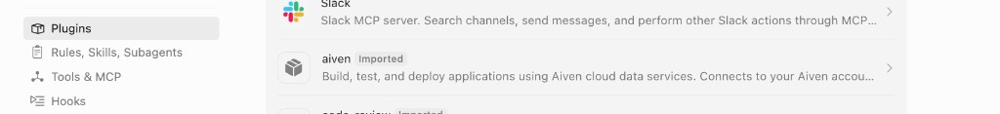
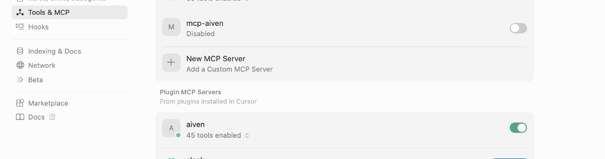

# Aiven AI Plugins

A plugin for Claude and Cursor to easily manage services at Aiven -  
Deploy managed PostgreSQL, Kafka, OpenSearch, ClickHouse, and other databases, streaming, and apps. Free tier available, up and running in minutes.

## Install

### Claude Code

1. Add the marketplace (needed until official):
   ```
   /plugin marketplace add aiven/aiven-ai-plugins
   ```
2. Run `/plugins`, search for "aiven", and select it to install.
3. Ask the agent to help you get started with Aiven — it will guide you through authentication and setup.

### Cursor

Until the plugin is official, see [Local development](#cursor-1) below.


## Local development

### Claude Code

```bash
git clone https://github.com/aiven/aiven-ai-plugins
claude --plugin-dir ./aiven-ai-plugins
```

### Cursor

```bash
git clone https://github.com/aiven/aiven-ai-plugins
```

Open the directory in Cursor — it will automatically detect the `.cursor-plugin/` directory and load the Aiven MCP server.

1. Go to **Plugins** and verify the aiven plugin appears as **Imported**:

   

2. Go to **Settings → Tools & MCP** and enable the **aiven** Plugin MCP Server:

   
